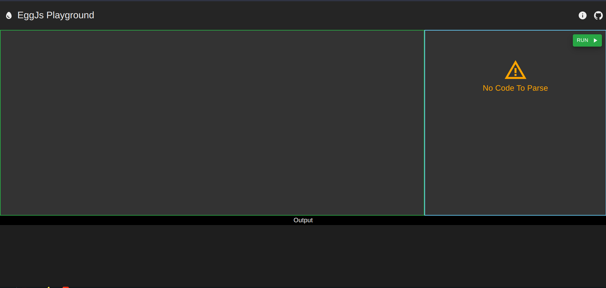
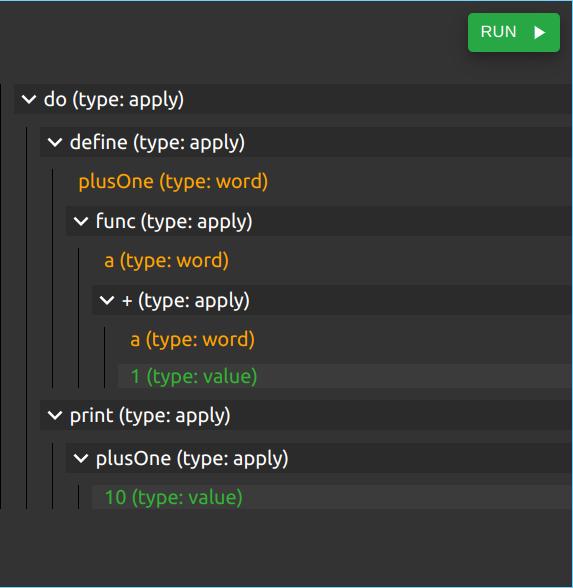
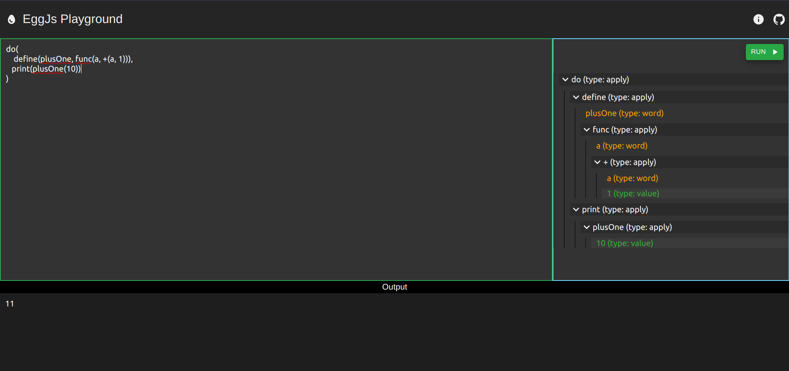
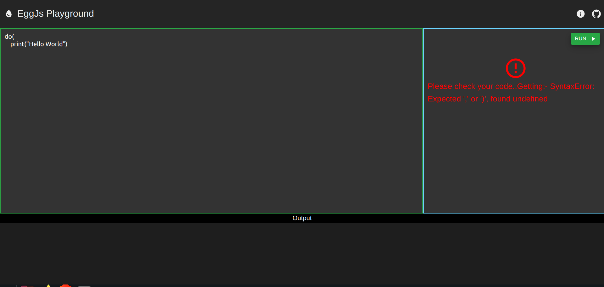
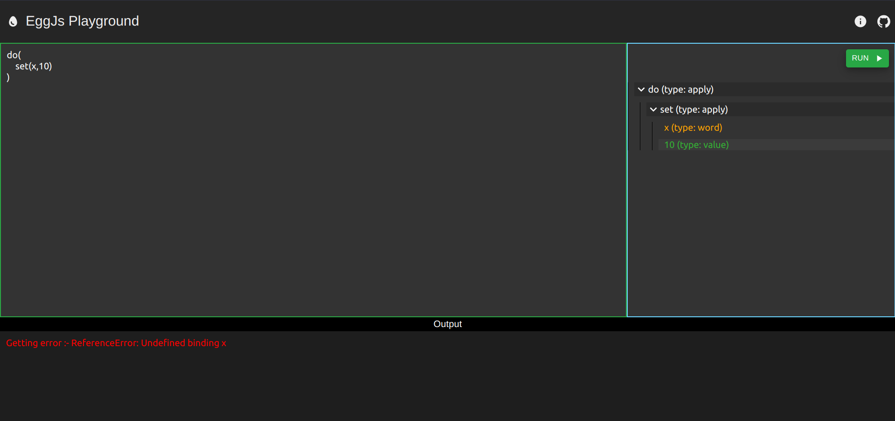

## EggJs Playground 
**EggJs Playground** is a web based editor for a primitive programming language **Egg** built using Javascript. Egg is featured as an example project in the book  [Eloquent Javascript](https://eloquentjavascript.net/12_language.html)  by Marjin Haverbeke.

### Screenshots 
---

### Some Things to Remember :
---
* Everything is an expression in Egg. Even '+' or '-' which are operators in Javascript are treated as expressions.
* Each expression in Egg would be an object. Thus, it would contain a type property, which would describe the type of the expression.
* Type:- 'value' means strings or numbers.
* Type:- 'word' means names of variables
* Type:- 'apply' means applications, eg. if else blocks, while loops, etc.
* All apply expressions have additional operator and args property.
* Comment lines start with a '#' character

### Basic Syntax :
--- 
* **print**
	* <ins>Description</ins>  :-  Prints the given value onto the console
	* <ins>Example</ins> :-  _print('Hello World')_

* **define**
	* <ins>Description</ins>  :-  Defines a variable with the given name and assigns it a value
	* <ins>Example</ins>  :-  _define(x,10)_

* **set**
	* <ins>Description</ins>  :-  Changes the value of a previously declared variable
	* <ins>Example</ins>  :-  _set(x,11)_

* **if**
	* <ins>Description</ins> :-  Conditional statement. Takes 3 arguments - condition, expression to execute if true, expression to execute if false
	* <ins>Example</ins>  :-  _if(<(x,5),print('small'), print('large'))_

* **array**
	* <ins>Description</ins>  :-  Creates an array with the specified elements
	* <ins>Example</ins>  :-  _define(arr, array(1,2,3))_

* **length**
	* <ins>Description</ins>  :-  Returns the length of an array
	* <ins>Example</ins>  :-  _length(arr)_

* **element**
	* <ins>Description</ins>  :-  Returns the element at specified index in array. Throws an error if index out of bounds
	* <ins>Example</ins>  :-  _element(arr, 0)_

* **do**
	* <ins>Description</ins>  :-  Defines a block of code.
	* <ins>Example</ins>  :-  _do(define(arr, array(1,2,3)), print(element(arr, 0)))_

* **while**
	* <ins>Description</ins> :-  Defines a while loop with condition and a loop body
	* <ins>Example</ins>  :-  _while(>(x,0), do(print(x), set(x, -(x,1))))_
	* 
* **func**
	* <ins>Description</ins>  :-  Defines a function with arguments and a body. Arguments are separated by commas and the last expression is body
	* <ins>Example</ins>  :-  _func(a,b,print(+(a,b)))_

<!-- # Getting Started with Create React App -->
<!---->
<!-- This project was bootstrapped with [Create React App](https://github.com/facebook/create-react-app). -->
<!---->
<!-- ## Available Scripts -->
<!---->
<!-- In the project directory, you can run: -->
<!---->
<!-- ### `npm start` -->
<!---->
<!-- Runs the app in the development mode.\ -->
<!-- Open [http://localhost:3000](http://localhost:3000) to view it in your browser. -->
<!---->
<!-- The page will reload when you make changes.\ -->
<!-- You may also see any lint errors in the console. -->
<!---->
<!-- ### `npm test` -->
<!---->
<!-- Launches the test runner in the interactive watch mode.\ -->
<!-- See the section about [running tests](https://facebook.github.io/create-react-app/docs/running-tests) for more information. -->
<!---->
<!-- ### `npm run build` -->
<!---->
<!-- Builds the app for production to the `build` folder.\ -->
<!-- It correctly bundles React in production mode and optimizes the build for the best performance. -->
<!---->
<!-- The build is minified and the filenames include the hashes.\ -->
<!-- Your app is ready to be deployed! -->
<!---->
<!-- See the section about [deployment](https://facebook.github.io/create-react-app/docs/deployment) for more information. -->
<!---->
<!-- ### `npm run eject` -->
<!---->
<!-- **Note: this is a one-way operation. Once you `eject`, you can't go back!** -->
<!---->
<!-- If you aren't satisfied with the build tool and configuration choices, you can `eject` at any time. This command will remove the single build dependency from your project. -->
<!---->
<!-- Instead, it will copy all the configuration files and the transitive dependencies (webpack, Babel, ESLint, etc) right into your project so you have full control over them. All of the commands except `eject` will still work, but they will point to the copied scripts so you can tweak them. At this point you're on your own. -->
<!---->
<!-- You don't have to ever use `eject`. The curated feature set is suitable for small and middle deployments, and you shouldn't feel obligated to use this feature. However we understand that this tool wouldn't be useful if you couldn't customize it when you are ready for it. -->
<!---->
<!-- ## Learn More -->
<!---->
<!-- You can learn more in the [Create React App documentation](https://facebook.github.io/create-react-app/docs/getting-started). -->
<!---->
<!-- To learn React, check out the [React documentation](https://reactjs.org/). -->
<!---->
<!-- ### Code Splitting -->
<!---->
<!-- This section has moved here: [https://facebook.github.io/create-react-app/docs/code-splitting](https://facebook.github.io/create-react-app/docs/code-splitting) -->
<!---->
<!-- ### Analyzing the Bundle Size -->
<!---->
<!-- This section has moved here: [https://facebook.github.io/create-react-app/docs/analyzing-the-bundle-size](https://facebook.github.io/create-react-app/docs/analyzing-the-bundle-size) -->
<!---->
<!-- ### Making a Progressive Web App -->
<!---->
<!-- This section has moved here: [https://facebook.github.io/create-react-app/docs/making-a-progressive-web-app](https://facebook.github.io/create-react-app/docs/making-a-progressive-web-app) -->
<!---->
<!-- ### Advanced Configuration -->
<!---->
<!-- This section has moved here: [https://facebook.github.io/create-react-app/docs/advanced-configuration](https://facebook.github.io/create-react-app/docs/advanced-configuration) -->
<!---->
<!-- ### Deployment -->
<!---->
<!-- This section has moved here: [https://facebook.github.io/create-react-app/docs/deployment](https://facebook.github.io/create-react-app/docs/deployment) -->
<!---->
<!-- ### `npm run build` fails to minify -->
<!---->
<!-- This section has moved here: [https://facebook.github.io/create-react-app/docs/troubleshooting#npm-run-build-fails-to-minify](https://facebook.github.io/create-react-app/docs/troubleshooting#npm-run-build-fails-to-minify) -->
